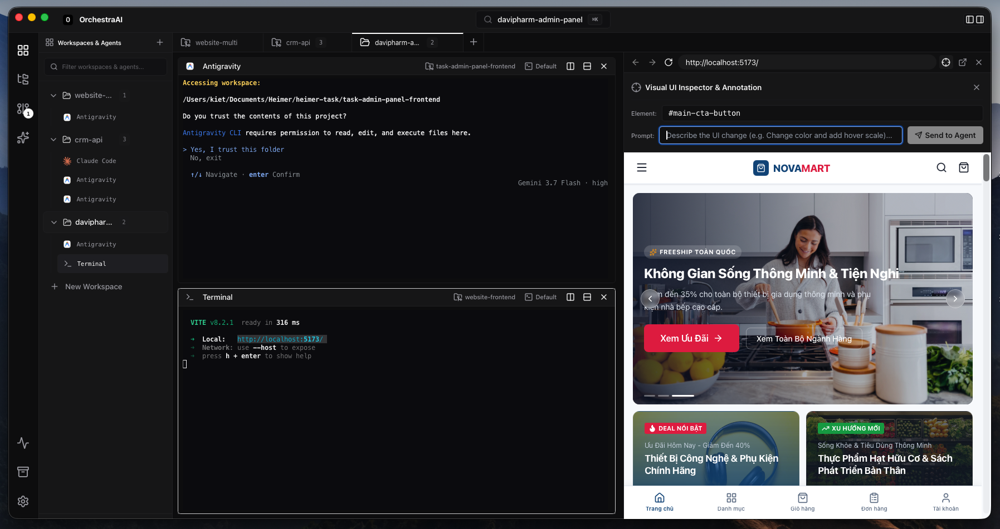
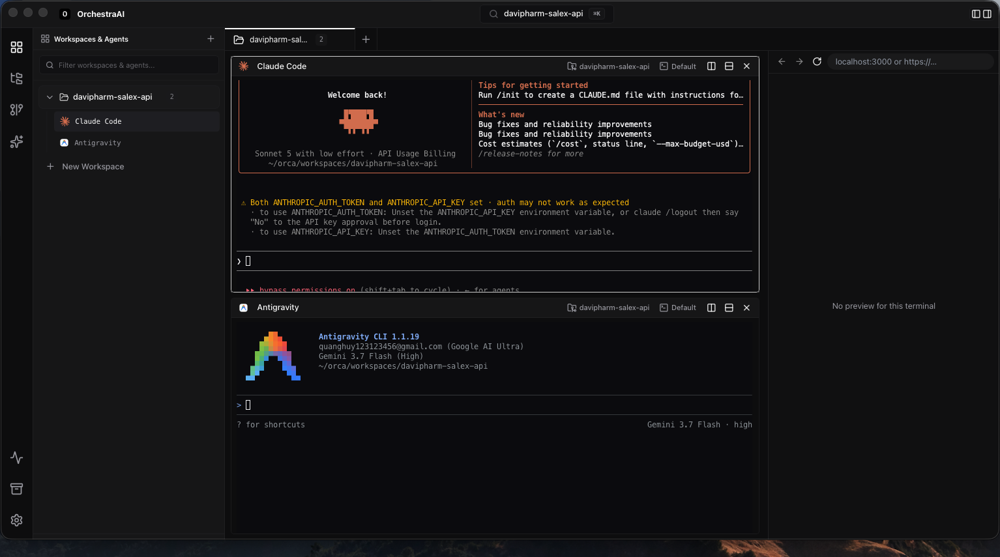
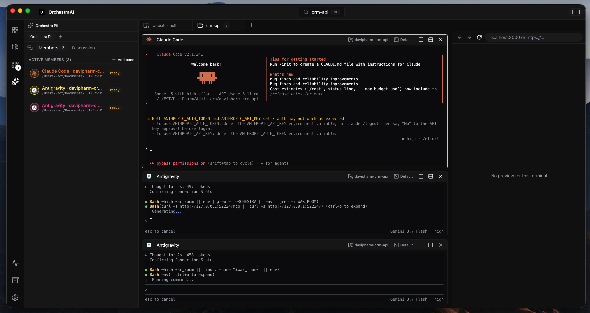
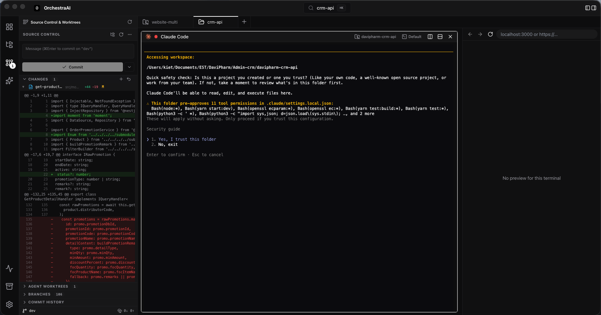
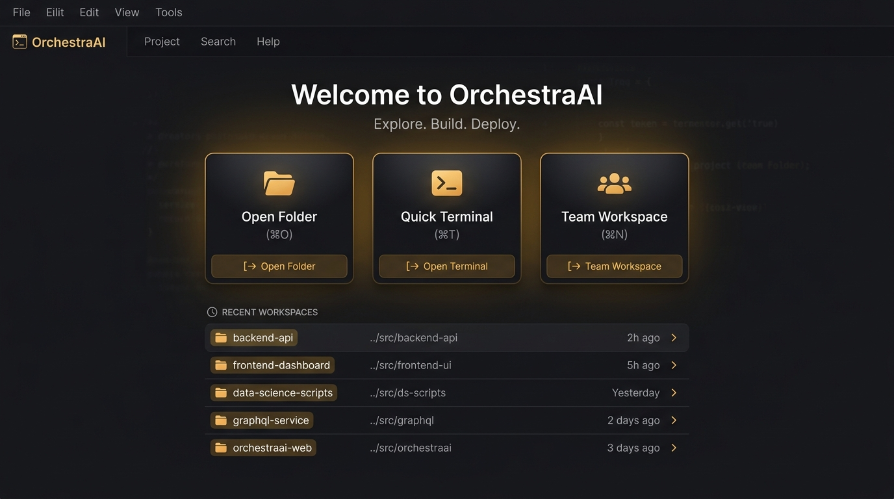

<div align="center">


# OrchestraAI

**The Native Multi-Agent Collaborative Development Studio**

A desktop engineering environment for conducting teams of autonomous AI coding agents — real split pseudo-terminals, isolated per-agent Git worktrees, embedded web browser with visual UI inspection, and an Orchestra Pit collaboration network powered by the Model Context Protocol (MCP).

<br />

[](LICENSE)
[](#download--installation)
[](https://tauri.app)
[](https://react.dev)
[](https://rust-lang.org)
[]()

<br />



</div>

---

## Table of Contents

- [Overview](#overview)
- [Key Features](#key-features)
  - [1. Real Split Terminals & Process Sniffing](#1-real-split-terminals--process-sniffing)
  - [2. The Orchestra Pit (MCP Multi-Agent Collaboration)](#2-the-orchestra-pit-mcp-multi-agent-collaboration)
  - [3. Live Web Browser & Visual UI Inspector](#3-live-web-browser--visual-ui-inspector)
  - [4. Isolated Git Worktrees & Diff Inspector](#4-isolated-git-worktrees--diff-inspector)
  - [5. Workspace Hierarchy & Inline Terminal Renaming](#5-workspace-hierarchy--inline-terminal-renaming)
  - [6. Real-Time Token Tracking & Cost Estimation](#6-real-time-token-tracking--cost-estimation)
  - [7. Conduct (Broadcast) Mode](#7-conduct-broadcast-mode)
  - [8. Team Templates & Quick Starts](#8-team-templates--quick-starts)
- [Supported AI Coding Agents](#supported-ai-coding-agents)
- [Download & Installation](#download--installation)
- [Building from Source](#building-from-source)
- [Keyboard Shortcuts](#keyboard-shortcuts)
- [Security & Privacy Model](#security--privacy-model)
- [Contributing](#contributing)
- [License](#license)

---

## Overview

Modern agentic coding tools like **Claude Code**, **Google Antigravity**, **OpenAI Codex**, and **OpenCode** excel at executing autonomous development tasks. However, when orchestrating multiple agents simultaneously in traditional terminal tabs:

1. **Context Fragmentation**: Streaming outputs, user prompts, and background approvals disappear behind tabs.
2. **File System Collisions**: Two agents working in the same working directory inevitably overwrite each other's work and create race conditions.
3. **The Conductor Bottleneck**: Developers spend excessive time manually copy-pasting API contracts, design documents, and diffs between separate terminal windows.

**OrchestraAI** is an open-source, native desktop studio engineered to solve these challenges. It unifies terminal multiplexing, Git worktree isolation, live application previews, and inter-agent communication protocols into a single, cohesive developer cockpit.

---

## Key Features

### 1. Real Split Terminals & Process Sniffing

OrchestraAI lets you arrange terminal panes horizontally and vertically in any arbitrary nested configuration.

- **Automatic Agent Recognition**: Sniffs foreground process executions and OSC window titles (`claude`, `agy`, `codex`, `gemini`, `opencode`, `grok`, `deepseek`) to automatically render official agent brand icons.
- **Live Output Pulsing**: Terminal icons feature pulsing activity rings whenever an agent is generating code or running commands.
- **State Rollup Dots**: Displays agent lifecycle states directly in headers and sidebar nodes:
  - `Thinking / Generating`: Agent is actively analyzing or outputting code.
  - `Waiting for Input`: Agent requires human permission or user feedback.
  - `Idle / Ready`: Agent completed its current objective.

<div align="center">
  
  <p><em>Figure 1: Multi-Agent split grid running Claude Code and Google Antigravity in parallel.</em></p>
</div>

---

### 2. The Orchestra Pit (MCP Multi-Agent Collaboration)

The **Orchestra Pit** provides a unified chat and coordination room where agents collaborate autonomously rather than operating in silos.

- **Autonomous Agent Conversations**: Agents use MCP tools (`list_peers`, `send_message`, `read_inbox`) to discuss API specifications, coordinate schema migrations, and request code reviews from peer agents.
- **Visual Team Roster**: Inspect connected agents, active working directories, pending queues, and live execution statuses.
- **1-Click / Drag-and-Drop Joining**: Drag terminal pane headers directly into the Orchestra Pit drop zone, or use the member picker dropdown to add agents instantly.
- **Conductor Broadcast**: Intervene at any time to issue directives or inject global instructions across all participating agents.

<div align="center">
  
  <p><em>Figure 2: Real-time discussion room where Claude Code and Antigravity collaborate via MCP.</em></p>
</div>

---

### 3. Live Web Browser & Visual UI Inspector

An integrated web preview column sits alongside your terminal panes for frontend and full-stack development.

- **Localhost Preview**: Automatically discovers and displays running development servers (e.g. `localhost:3000`, `localhost:5173`, Next.js, Vite, Astro, Remix).
- **Interactive DOM Element Picker**: Click the target tool to hover and inspect any DOM node on the live webpage.
- **1-Click Prompt Annotation**: Annotate UI elements with prompt requests (e.g., *"Make this banner responsive and add dark mode support"*). Clicking **Send to Agent** injects the annotated selector and context directly into the focused agent terminal.

---

### 4. Isolated Git Worktrees & Diff Inspector

Developing with multiple agents on the same working tree causes continuous file conflicts and merge collisions.

- **Zero-Conflict Branch Isolation**: Automatically creates isolated Git worktrees (`orchestra/<agent-role>`) on independent branches.
- **Built-in Diff Inspector**: Review staged and unstaged code modifications across all files with syntax-highlighted side-by-side or unified diff views.
- **Integrated Source Control Panel**: View branch lists, commit history timelines, and stage/commit changes without leaving OrchestraAI.

<div align="center">
  
  <p><em>Figure 3: Built-in Source Control panel with color-coded syntax diffs and worktree management.</em></p>
</div>

---

### 5. Workspace Hierarchy & Inline Terminal Renaming

- **Hierarchical Sidebar Tree**: Organizes multiple open project workspaces, active Git branches, and child terminal panes in a clean tree structure.
- **Instant Search Filter**: Quickly find any workspace, agent, or terminal name using the search bar at the top of the sidebar.
- **Inline Double-Click Renaming**: Double-click any terminal label or workspace name to customize its title (e.g., *"Lead Architect"*, *"Frontend UI"*, *"Unit Tests"*).
- **Agent CLI Switching**: Use the terminal context menu (`...`) to reassign or switch the running agent CLI on the fly.

---

### 6. Real-Time Token Tracking & Cost Estimation

OrchestraAI parses context window usage metrics directly from terminal outputs and agent status streams:

- **Per-Terminal Token Usage**: Monitors input tokens, output tokens, and cache creation/read tokens.
- **Real-Time Cost Calculations**: Accurately computes running costs for Claude 3.7 Sonnet, Claude 3.5 Sonnet, GPT-4o, Gemini 2.5 Pro, and DeepSeek V3 based on current pricing tables.
- **Session Totals**: Aggregates total token consumption and expenses across all active workspaces.

---

### 7. Conduct (Broadcast) Mode

- Press **`⇧⌘B`** (macOS) or **`Ctrl+Shift+B`** (Windows/Linux) to toggle Conduct Mode.
- All keystrokes and submitted prompts are mirrored simultaneously to all active terminal panes.
- Useful for running mass test suites, batch installing dependencies, or issuing identical instructions across a team of agents.

---

### 8. Team Templates & Quick Starts

Get started immediately from the Welcome Hub without tedious manual configuration:

- **Open Folder (`⌘O`)**: Instantly creates a workspace from any existing project directory.
- **Quick Terminal (`⌘T`)**: Opens a standalone shell session in your home directory.
- **Pre-Configured Team Presets (`⌘N`)**:
  - **Feature Factory** (4 agents: Architect + Frontend + Backend + QA)
  - **Bug Hunt** (2 agents: Root Cause Investigator + Fixer)
  - **Refactor Sprint** (3 agents: Codebase Analyzer + Refactorer + Test Coverage)
  - **Docs Writer** (2 agents: Code Reader + Technical Author)
  - **Full Stack Team** (6 agents: Tech Lead + Frontend + Backend + Database + DevOps + QA)

<div align="center">
  
  <p><em>Figure 4: The Welcome Hub with 1-click project launches and recent workspace history.</em></p>
</div>

---

## Supported AI Coding Agents

OrchestraAI works out of the box with any terminal-based agent or command-line utility:

| Agent / Tool | Identifier | Default Command | Detection & MCP Support |
| :--- | :--- | :--- | :--- |
| **Claude Code** | `claude-code` | `claude --dangerously-skip-permissions` | Full MCP + Statusline + Tokens |
| **Google Antigravity** | `antigravity` | `agy` | Full MCP + Command Detection |
| **OpenAI Codex** | `codex` | `codex` | Full MCP + Command Detection |
| **OpenCode** | `opencode` | `opencode` | Full MCP + Command Detection |
| **Google Gemini CLI**| `gemini` | `gemini` | Command Detection |
| **DeepSeek Coder** | `deepseek` | `deepseek` | Command Detection |
| **xAI Grok** | `grok` | `grok` | Command Detection |
| **GitHub Copilot** | `copilot` | `gh copilot suggest` | Command Detection |
| **Standard Shells** | `terminal` | System default (`zsh`, `bash`, `fish`, `pwsh`) | Full PTY Support |

---

## Download & Installation

### One-Line Terminal Install

Install OrchestraAI instantly with a single command in your terminal:

**macOS & Linux**:
```bash
curl -fsSL https://raw.githubusercontent.com/tuankiet30902/orchestraai/main/install.sh | bash
```

**Windows (PowerShell as Administrator)**:
```powershell
irm https://raw.githubusercontent.com/tuankiet30902/orchestraai/main/install.ps1 | iex
```

---

### Package Managers

| Package Manager | Platform | Command |
| :--- | :--- | :--- |
| **Homebrew Cask** | macOS | `brew install --cask orchestraai` |
| **WinGet** | Windows | `winget install OrchestraAI` |

---

### Direct Download Packages

Pre-compiled binary releases for **macOS**, **Windows**, and **Linux** are published on [GitHub Releases](https://github.com/tuankiet30902/orchestraai/releases):

| Operating System | Architecture | Package Format | Direct Download |
| :--- | :--- | :--- | :--- |
| 🍏 **macOS** | Universal *(Apple Silicon M1-M4 & Intel)* | `.dmg` | [Download `OrchestraAI_0.1.0_universal.dmg`](https://github.com/tuankiet30902/orchestraai/releases/download/v0.1.0/OrchestraAI_0.1.0_universal.dmg) |
| 🪟 **Windows** | x64 / ARM64 | `.exe` (Installer) | [Download `OrchestraAI_0.1.0_x64-setup.exe`](https://github.com/tuankiet30902/orchestraai/releases/download/v0.1.0/OrchestraAI_0.1.0_x64-setup.exe) |
| 🪟 **Windows** | x64 | `.msi` (Enterprise) | [Download `OrchestraAI_0.1.0_x64_en-US.msi`](https://github.com/tuankiet30902/orchestraai/releases/download/v0.1.0/OrchestraAI_0.1.0_x64_en-US.msi) |
| 🐧 **Linux** | x86_64 | `.AppImage` (Standalone) | [Download `OrchestraAI_0.1.0_amd64.AppImage`](https://github.com/tuankiet30902/orchestraai/releases/download/v0.1.0/OrchestraAI_0.1.0_amd64.AppImage) |
| 🐧 **Linux** | x86_64 | `.deb` (Debian / Ubuntu) | [Download `OrchestraAI_0.1.0_amd64.deb`](https://github.com/tuankiet30902/orchestraai/releases/download/v0.1.0/OrchestraAI_0.1.0_amd64.deb) |
| 🐧 **Linux** | x86_64 | `.rpm` (Fedora / RHEL) | [Download `OrchestraAI-0.1.0-1.x86_64.rpm`](https://github.com/tuankiet30902/orchestraai/releases/download/v0.1.0/OrchestraAI-0.1.0-1.x86_64.rpm) |

---

## Building from Source

### Prerequisites
- **Node.js 18+** & `npm` ([nodejs.org](https://nodejs.org))
- **Rust Toolchain (stable)** ([rustup.rs](https://rustup.rs))
- **Git**

### Build Steps

```bash
# 1. Clone the repository
git clone https://github.com/tuankiet30902/orchestraai.git
cd orchestraai

# 2. Install frontend dependencies
npm install

# 3. Launch in development mode with HMR
npm run tauri dev

# 4. Execute test suite (839 unit tests)
npm test

# 5. Build optimized native distribution package
npm run tauri build
```

---

## Keyboard Shortcuts

| Action | macOS Shortcut | Windows / Linux Shortcut |
| :--- | :--- | :--- |
| **Open Project Folder** | `⌘O` | `Ctrl+O` |
| **Quick Terminal** | `⌘T` | `Ctrl+T` |
| **New Team Workspace** | `⌘N` | `Ctrl+N` |
| **Toggle Primary Sidebar** | `⌘B` | `Ctrl+B` |
| **Toggle Conduct (Broadcast) Mode** | `⇧⌘B` | `Ctrl+Shift+B` |
| **Split Pane Horizontal** | `⌘D` | `Ctrl+D` |
| **Split Pane Vertical** | `⇧⌘D` | `Ctrl+Shift+D` |
| **Close Active Pane** | `⌘W` | `Ctrl+W` |
| **Find / Search in Terminal** | `⌘F` | `Ctrl+F` |
| **Open Settings** | `⌘,` | `Ctrl+,` |
| **Next Workspace Tab** | `⌃Tab` | `Ctrl+Tab` |
| **Previous Workspace Tab** | `⌃⇧Tab` | `Ctrl+Shift+Tab` |

---

## Security & Privacy Model

- **100% Local Execution**: Terminal sessions, PTY processes, MCP communication, and Git worktrees run entirely on your local machine.
- **Zero Telemetry**: No user data, commands, keystrokes, or code snippets are collected or transmitted.
- **Termination Guard**: Prevents accidental closure of terminal panes while an AI agent is actively executing tasks.

---

## Contributing

Contributions, bug reports, and feature suggestions are welcome!

1. Fork the repository on GitHub.
2. Create your feature branch (`git checkout -b feature/amazing-feature`).
3. Commit your changes (`git commit -m 'feat: add amazing feature'`).
4. Push to the branch (`git push origin feature/amazing-feature`).
5. Open a Pull Request.

---

## License

OrchestraAI is free and open-source software licensed under the **[GNU General Public License v3.0 (GPL-3.0)](LICENSE)**.

---

<div align="center">
<sub>Crafted with precision by <a href="https://github.com/tuankiet30902">Kiet Tran</a> · Built with <a href="https://tauri.app">Tauri 2</a>, <a href="https://react.dev">React 19</a>, <a href="https://xtermjs.org">xterm.js</a>, and <a href="https://github.com/wez/wezterm/tree/main/pty">portable-pty</a>.</sub>
</div>
