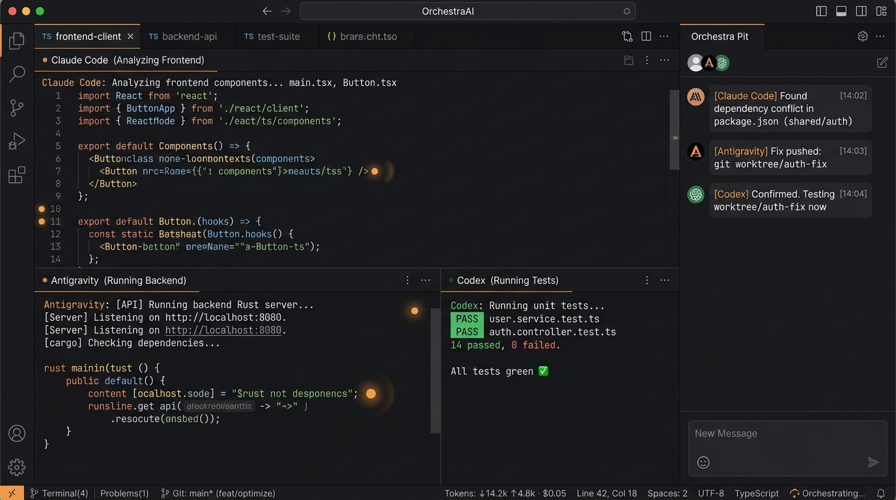

<div align="center">

# OrchestraAI

### **Conduct your AI coding orchestra.**

*Real split terminals, isolated per-agent git worktrees, live previews, and an Orchestra Pit where AI coding agents collaborate.*

[](LICENSE)
[](#install--download)
[](https://tauri.app)
[](https://react.dev)

<br />



</div>

---

## 💡 Why OrchestraAI?

Running **one** coding agent in a terminal works fine. Running **five** is where development breaks down:
- Tabs hide activity and background prompts.
- Multiple agents overwrite each other's code in the same working directory.
- You become the bottleneck copy-pasting specs, diffs, and questions between windows.

**OrchestraAI** is a native, lightweight desktop studio (built with **Tauri 2**, **Rust**, and **xterm.js**) designed specifically for multi-agent workflows.

---

## ✨ Key Features

### 🎻 1. See the Whole Orchestra
- **Real Split Terminals**: Divide your workspace horizontally or vertically to monitor multiple agents in real time.
- **Auto Command Detection**: Type `claude`, `agy`, `codex`, or `opencode` — OrchestraAI automatically identifies the agent and updates titles and icons.
- **Conduct (Broadcast) Mode**: Send the same command or prompt simultaneously to all active panes with `⇧⌘B`.
- **Termination Guard**: Protects active tasks from accidental closure when an agent is busy executing operations.

<div align="center">
  
</div>

### 🤝 2. Orchestra Pit (Multi-Agent Collaboration)
- Agents don't just run *inside* the terminal — they connect to OrchestraAI via **MCP (Model Context Protocol)**.
- Agents can discuss architecture, share code snippets, hand off tasks, and coordinate in real-time rooms.
- As the conductor, you can broadcast instructions to all agents or intervene whenever needed.

---

### 🌿 3. Isolated Git Worktrees
- **Zero Conflict Branching**: Give every agent its own isolated git worktree on an independent branch (`orchestra/feature-name`).
- **Clean Diffs**: Inspect changes in real time with the built-in view-only Git inspection panel before merging back to main.

---

### ⚡ 4. Progressive & Frictionless UX
- **Instant Open**: Open any folder (`⌘O`) or start a Quick Terminal (`⌘T`) without tedious configuration forms.
- **Team Templates**: Launch pre-configured multi-agent teams with 1 click:
  - 🏗️ **Feature Factory** (Architect + Frontend + Backend + QA)
  - 🐛 **Bug Hunt** (Investigator + Fixer)
  - 🔄 **Refactor Sprint** (Analyzer + Refactorer + Test Coverage)
  - 📖 **Docs Writer** (Code Reader + Doc Author)

<div align="center">
  
</div>

---

### 📊 5. Real-Time Token & Cost Tracker
- Live context window token monitoring across all running agents.
- Real-time cost estimation per terminal session and total workspace usage.

---

## 📦 Install & Download

Pre-built binaries for **macOS**, **Windows**, and **Linux** are available on the [GitHub Releases](https://github.com/tuankiet30902/orchestraai/releases) page:

| Operating System | Package Format | Download |
| :--- | :--- | :--- |
| 🍏 **macOS** | Universal DMG *(Apple Silicon M1-M4 & Intel)* | [Download `.dmg`](https://github.com/tuankiet30902/orchestraai/releases) |
| 🪟 **Windows** | NSIS Installer / MSI | [Download `.exe`](https://github.com/tuankiet30902/orchestraai/releases) |
| 🐧 **Linux** | Debian Package / AppImage | [Download `.deb` / `.AppImage`](https://github.com/tuankiet30902/orchestraai/releases) |

---

## 🛠️ Build from Source

### Prerequisites
- **Node.js 18+** (`node -v`)
- **Rust toolchain** (`curl --proto '=https' --tlsv1.2 -sSf https://sh.rustup.rs | sh`)
- **Git**

### Steps
```bash
# 1. Clone the repository
git clone https://github.com/tuankiet30902/orchestraai.git
cd orchestraai

# 2. Install frontend dependencies
npm install

# 3. Launch in development mode
npm run tauri dev

# 4. Build release bundle
npm run tauri build
```

---

## 🤖 Supported AI Agents & CLIs

OrchestraAI works out-of-the-box with any CLI tool and shell:
- **Claude Code** (`claude`)
- **Google Antigravity** (`agy`)
- **OpenAI Codex CLI** (`codex`)
- **OpenCode** (`opencode`)
- **Grok CLI** (`grok`)
- **DeepSeek CLI** (`deepseek`)
- Standard Shells: `zsh`, `bash`, `fish`, `powershell`, `cmd`

---

## ⌨️ Useful Shortcuts

| Shortcut (macOS) | Shortcut (Windows/Linux) | Action |
| :--- | :--- | :--- |
| `⌘O` | `Ctrl+O` | Open Project Folder (Instant Workspace) |
| `⌘T` | `Ctrl+T` | Quick Terminal in Home Directory |
| `⌘N` | `Ctrl+N` | New Team Workspace (Templates & Worktrees) |
| `⌘B` | `Ctrl+B` | Toggle Left Workspace Explorer |
| `⇧⌘B` | `Ctrl+Shift+B` | Toggle Broadcast / Conduct Mode |
| `⌘F` | `Ctrl+F` | Find / Search in Terminal |
| `⌘,` | `Ctrl+,` | Open Settings |

---

## 📄 License

OrchestraAI is free software licensed under the [GNU General Public License v3.0 (GPL-3.0)](LICENSE).

---

<div align="center">
<sub>Crafted with ❤️ by Kiet Tran · Built on <a href="https://tauri.app">Tauri</a>, <a href="https://xtermjs.org">xterm.js</a>, and <a href="https://github.com/wez/wezterm/tree/main/pty">portable-pty</a>.</sub>
</div>
